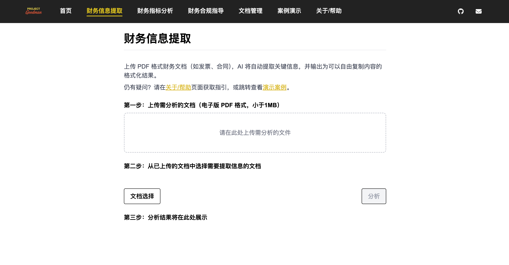
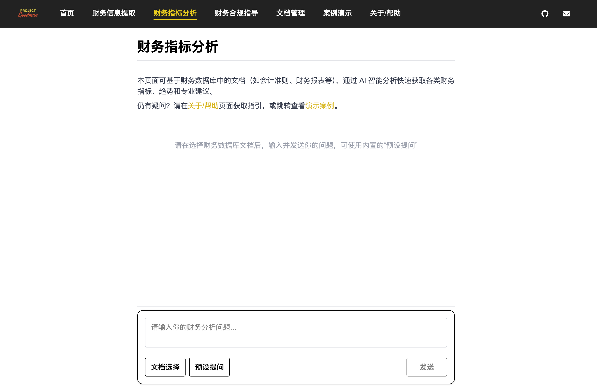
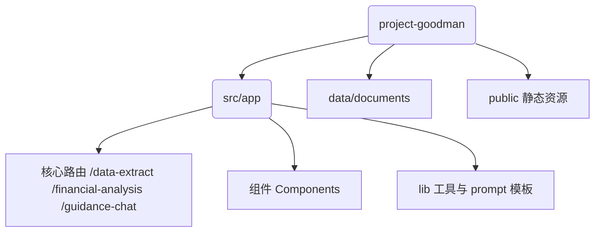

# 

# Project Goodman · AI 智能财务助手

> 让财务工作流全自动、零压力

[在线体验 Demo](https://goodman.antelacus.com)｜[License: AGPL-3.0](https://www.gnu.org/licenses/agpl-3.0.html)

---

## 功能概览

| 模块 | 描述 | 典型场景 |
|------|------|-----------|
| **财务信息提取** | 上传 PDF 文档，AI 自动抽取关键信息并生成结构化结果 | 合同、发票、报表 |
| **财务指标分析** | 基于数据库文档，AI 对话式计算财务指标 | 财报分析、趋势预测 |
| **财务合规指导** | 结合法规+业务文档，判断处理是否合规并给出建议 | 税务筹划、风险识别 |

<details>
<summary>📸 项目截图（点击展开）</summary>

| 首页 | 信息提取 | 指标分析 | 合规指导 |
|------|----------|----------|----------|
|  |  |  |  |

</details>

---

## 快速开始

```bash
git clone https://github.com/antelacus/project-goodman.git
cd project-goodman

# 安装依赖
npm install   # 或 pnpm / yarn

# 配置环境变量
cp .env.example .env.local
# 在 .env.local 中填入你的 OPENAI_API_KEY

# 本地运行开发服务器
npm run dev
```

访问 <http://localhost:3000> 即可体验。

### Vercel 一键部署
1. Fork 本仓库并关联 Vercel
2. 在 Vercel Dashboard 设置 `OPENAI_API_KEY` 环境变量
3. 选择 **Next.js** 框架，点击 Deploy

---

## 亮点特性

- 🧠 **GPT-4.1** + OpenAI Embeddings，语义搜索精准匹配
- 📄 **零后端依赖**：文档解析与向量检索均在前端完成，兼容 Vercel 免费额度
- ⚡ **实时预览 & 复制**：分析结果一键复制，公式高亮可点击校验
- 🧩 **模块化架构**：易于接入自有 LLM / Embedding 服务
- 📱 **响应式 UI**：Tailwind CSS 4 打造现代财务应用体验

---

## 技术栈

| 类别 | 选型 |
|------|------|
| 前端框架 | Next.js 15 · React 19 |
| 状态管理 | Zustand |
| 样式 | Tailwind CSS 4 |
| AI 服务 | OpenAI GPT-4.1 · Embeddings |
| 文档处理 | pdfjs-dist · xlsx |
| 部署 | Vercel Serverless |

---

## 目录结构摘要



---

## Roadmap

- [x] MVP 三大核心功能
- [ ] 多模型适配 & 企业 SSO
- [ ] 自定义指标公式编辑器
- [ ] 团队协作 & 审计追踪

---

## 贡献指南

欢迎 Issue / PR！在提交之前请确保：

1. 运行 `npm run lint` 通过 ESLint 检查
2. `npm run test` 通过单元测试（如有）
3. 遵循 [Conventional Commits](https://www.conventionalcommits.org/zh-hans/v1.0.0/) 提交信息

---

## License

[AGPL-3.0](https://www.gnu.org/licenses/agpl-3.0.html)

---

## 联系方式

若有合作或招聘意向，请联系：**me@antelacus.com**
