# 

# Project Goodman · AI 智能财务助手

> 让财务工作流全自动、零压力

[在线体验 Demo](https://goodman.antelacus.com)｜[License: AGPL-3.0](https://www.gnu.org/licenses/agpl-3.0.html)

---

## 功能概览

| 模块 | 描述 | 典型场景 |
|------|------|-----------|
| **财务信息提取** | 上传 PDF 文档，AI 自动抽取关键信息并生成结构化结果 | 合同、发票、报表 |
| **财务指标分析** | 基于数据库文档，AI 对话式计算财务指标 | 财报分析、趋势预测 |
| **财务合规指导** | 结合法规+业务文档，判断处理是否合规并给出建议 | 税务筹划、风险识别 |

<details>
<summary>📸 项目截图（点击展开）</summary>

| 首页 | 信息提取 | 指标分析 | 合规指导 |
|------|----------|----------|----------|
|  |  |  |  |

</details>

---

## 快速开始

### 前置要求

1. **Node.js** 18+
2. **OpenAI API Key**
3. **Supabase 账号**（免费版即可）

### 安装与配置

```bash
# 1. 克隆仓库
git clone https://github.com/antelacus/project-goodman.git
cd project-goodman

# 2. 安装依赖
npm install   # 或 pnpm / yarn

# 3. 配置环境变量
cp .env.example .env.local
```

### 配置 Supabase 数据库

#### 步骤 1: 创建 Supabase 项目

1. 访问 [supabase.com](https://supabase.com) 并注册/登录
2. 点击 "New Project" 创建项目
3. 记录项目的 **URL** 和 **anon key**

#### 步骤 2: 运行数据库迁移

1. 进入 Supabase 项目的 **SQL Editor**
2. 复制 `supabase/migrations/20250107000000_init_vector_database.sql` 的全部内容
3. 粘贴到 SQL Editor 并点击 "Run"
4. 确认执行成功

#### 步骤 3: 配置环境变量

在 `.env.local` 中填入以下信息：

```bash
# OpenAI API
OPENAI_API_KEY=your_openai_api_key_here

# Supabase Database
NEXT_PUBLIC_SUPABASE_URL=your_supabase_project_url
NEXT_PUBLIC_SUPABASE_ANON_KEY=your_supabase_anon_key
```

#### 步骤 4: 迁移知识库文档

```bash
# 将现有文档迁移到 Supabase
npm run migrate-data

# 或先运行 dry-run 测试
npm run migrate-data:dry-run
```

#### 步骤 5: 启动开发服务器

```bash
npm run dev
```

访问 <http://localhost:3000> 即可体验。

---

### Vercel 部署

1. Fork 本仓库并关联 Vercel
2. 在 Vercel Dashboard 设置以下环境变量：
   - `OPENAI_API_KEY`
   - `NEXT_PUBLIC_SUPABASE_URL`
   - `NEXT_PUBLIC_SUPABASE_ANON_KEY`
3. 选择 **Next.js** 框架，点击 Deploy

---

## 亮点特性

- 🧠 **GPT-4.1** + OpenAI Embeddings，语义搜索精准匹配
- 🗄️ **向量数据库**：Supabase PostgreSQL + pgvector，生产级向量存储与检索
- ⚡ **实时预览 & 复制**：分析结果一键复制，公式高亮可点击校验
- 💾 **数据持久化**：用户上传文档自动向量化并持久化存储
- 🧩 **模块化架构**：易于接入自有 LLM / Embedding 服务
- 📱 **响应式 UI**：Tailwind CSS 4 打造现代财务应用体验
- 🚀 **Serverless 优先**：完全兼容 Vercel 免费部署

---

## 技术栈

| 类别 | 选型 |
|------|------|
| 前端框架 | Next.js 15 · React 19 |
| 状态管理 | Zustand |
| 样式 | Tailwind CSS 4 |
| 数据库 | Supabase (PostgreSQL + pgvector) |
| AI 服务 | OpenAI GPT-4.1 · text-embedding-3-small |
| 文档处理 | pdfjs-dist · xlsx |
| 部署 | Vercel Serverless |

---

## 架构概览

### RAG (检索增强生成) 流程

```mermaid
graph LR
  A[用户上传文档] --> B[客户端解析 PDF/Excel]
  B --> C[API 分块文本]
  C --> D[OpenAI 生成向量]
  D --> E[存储到 Supabase]
  E --> F[用户提问]
  F --> G[向量相似度搜索]
  G --> H[检索相关文本块]
  H --> I[GPT-4.1 生成答案]
```



### 数据库架构

**表结构**:
- `documents` - 文档元数据（知识型/业务型）
- `document_chunks` - 文本分块 + 向量嵌入 (1536维)

**核心功能**:
- `match_documents()` - pgvector 余弦相似度搜索
- 自动向量化处理用户上传文档
- 支持跨文档智能检索

---

## 目录结构摘要

```
project-goodman/
├── src/
│   ├── app/                    # Next.js 应用路由
│   │   ├── api/               # API 路由（向量化、RAG查询）
│   │   ├── data-extract/      # 信息提取模块
│   │   ├── financial-analysis/# 财务分析模块
│   │   └── guidance-chat/     # 合规指导模块
│   ├── components/            # React 组件
│   ├── lib/                   # 工具函数 & Prompt 模板
│   └── store/                 # Zustand 状态管理
├── supabase/
│   ├── migrations/            # 数据库迁移文件
│   └── README.md              # Supabase 设置指南
├── scripts/
│   ├── migrate-to-supabase.ts # 数据迁移脚本
│   └── preprocessor.py        # 文档预处理工具
├── data/
│   └── documents/             # 知识库文档（待迁移）
└── public/                    # 静态资源
```

---

## Roadmap

- [x] MVP 三大核心功能
- [x] 向量数据库集成（Supabase + pgvector）
- [x] 自动文档向量化处理
- [ ] 支持更多文件格式（XLSX, CSV, TXT）
- [ ] 多模型适配 & 企业 SSO
- [ ] 自定义指标公式编辑器
- [ ] 团队协作 & 审计追踪

---

## 开发指南

### 数据迁移

```bash
# 测试迁移（不写入数据）
npm run migrate-data:dry-run

# 执行实际迁移
npm run migrate-data
```

### 添加新的知识库文档

**方式一：使用 preprocessor.py**（推荐用于 PDF）

```bash
# 1. 将 PDF 文件放入 knowledge_docs/ 目录
# 2. 运行预处理脚本
python scripts/preprocessor.py

# 3. 将生成的 JSON 文件放入 data/documents/
# 4. 运行迁移
npm run migrate-data
```

**方式二：直接上传**
- 通过应用界面上传文档（自动向量化）
- 仅支持 PDF 格式（其他格式开发中）

### 本地开发

```bash
npm run dev        # 启动开发服务器
npm run build      # 构建生产版本
npm run lint       # ESLint 检查
```

更多技术细节请查看 `CLAUDE.md`。

---

## 贡献指南

欢迎 Issue / PR！在提交之前请确保：

1. 运行 `npm run lint` 通过 ESLint 检查
2. `npm run test` 通过单元测试（如有）
3. 遵循 [Conventional Commits](https://www.conventionalcommits.org/zh-hans/v1.0.0/) 提交信息

---

## License

[AGPL-3.0](https://www.gnu.org/licenses/agpl-3.0.html)

---

## 联系方式

若有合作或招聘意向，请联系：**me@antelacus.com**
